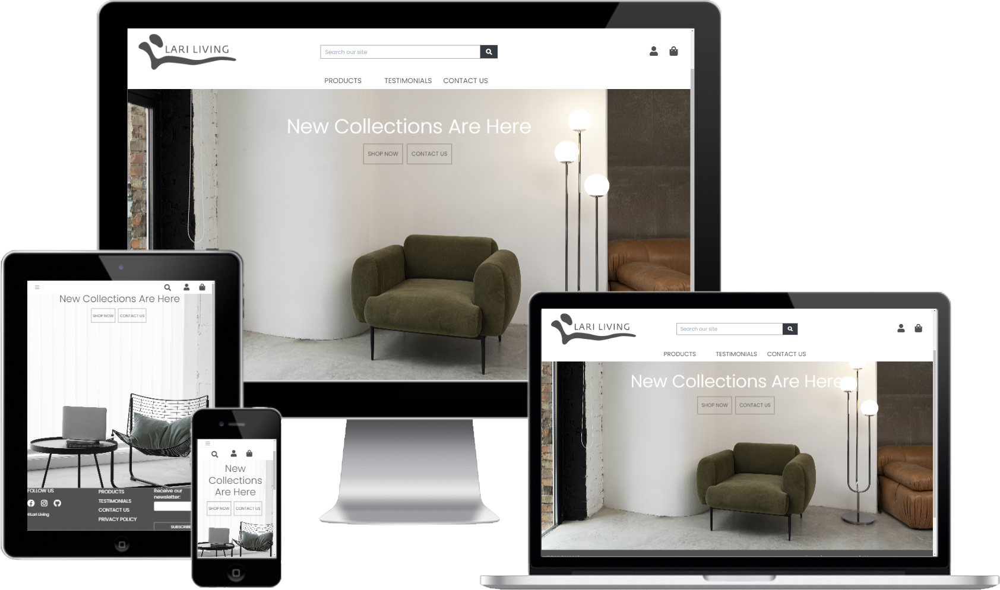
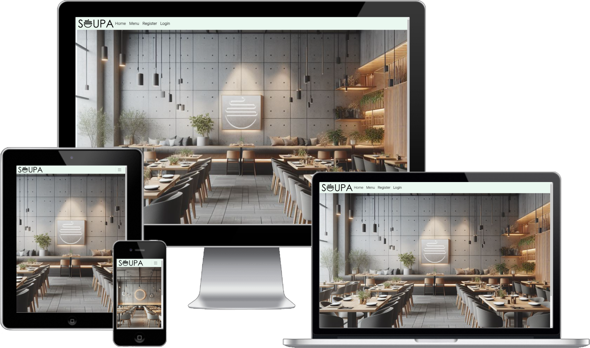
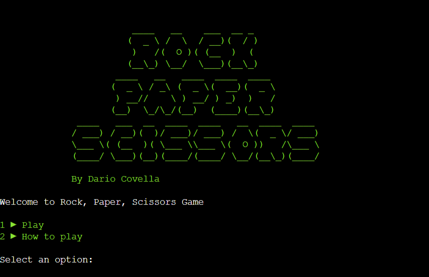
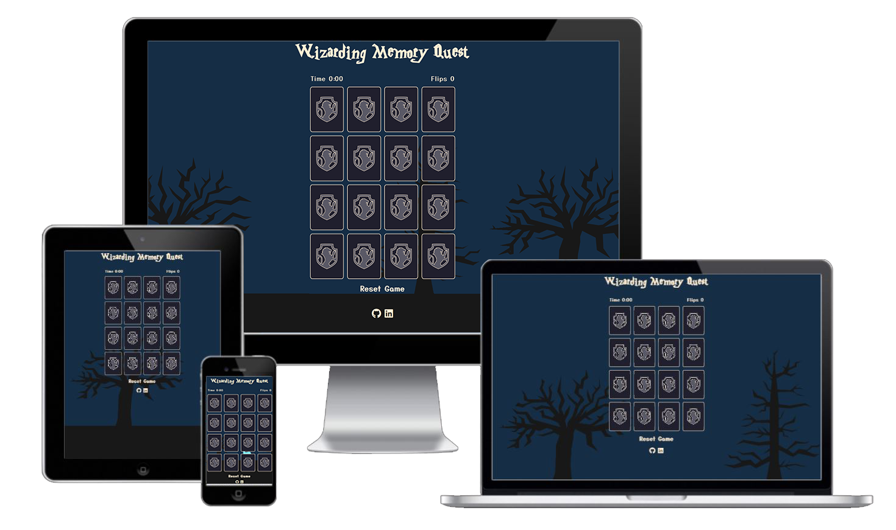

# 👨‍💻 Dario Covella

**`Junior Full Stack Software Developer`**

Junior Software Developer in the making.

Completed a 12-month Level 5 Diploma in Full Stack Web Applications at .

After almost a decade in architecture and design, I bring skills in project management, problem-solving, and communication. Seeking opportunities to leverage my diverse background within a development team to learn, grow, and contribute. 🚴

Get in touch: 

---

### 🧰 Languages and Tools

#### Programming Languages

    

#### Libraries and Frameworks

    

#### Version Control, Hosting & and other tools

    

#### Databases

    

---

### 👷‍♂️ My recent projects

#### Lari Living Home Decor eCommerce

#### Soupa Restaurant

#### Python Rock Paper Scissors

#### Memory Game  

 

Visit my [GitHub Repositories](https://github.com/Darioc18?tab=repositories) to explore and find out more!

---

### 📊 Stats

